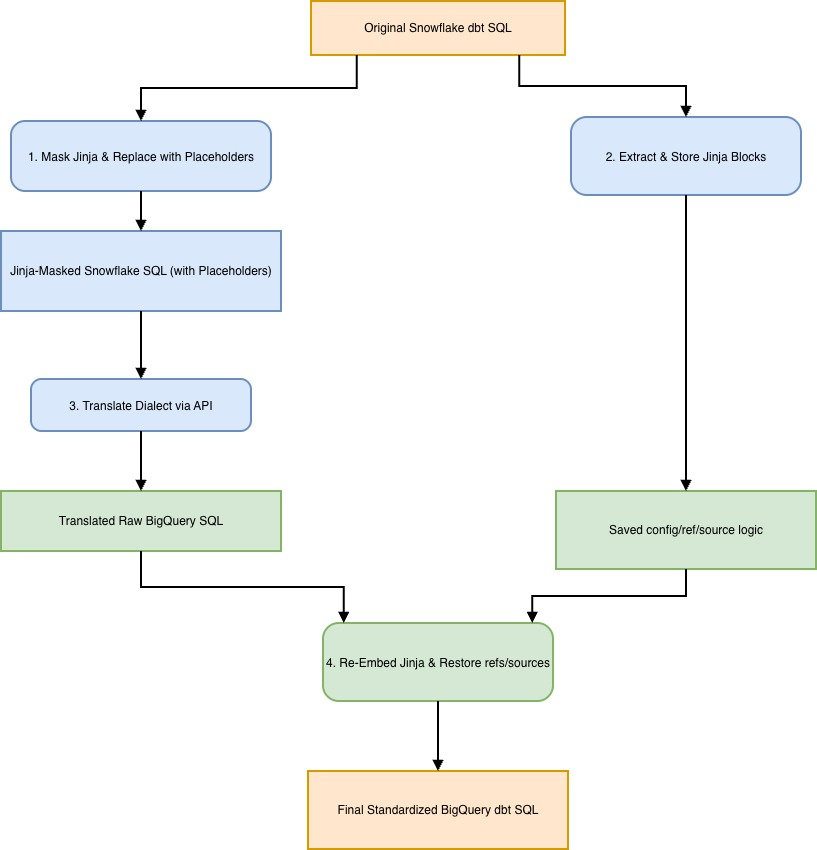

# DBT Snowflake to BigQuery Migration Skill

This skill (`dbt-sf-to-bq-translator`) accelerates the migration of Snowflake DBT models to Standardized Google BigQuery SQL. It automatically translates SQL models, handles Jinja re-embedding.



## Features

*   **Dialect Translation**: Translates Snowflake SQL to BigQuery standard SQL.
*   **Jinja Preservation**: Safely masks and restores dbt Jinja constructs (e.g., `ref`, `source`, `config`).
*   **Standardization**: Enforces Google-specific standards (copyright headers, explicit type casting, standardized JSON extraction).
*   **Deduplication**: Automatically handles deduplication patterns.

---

## Configuration & Credentials Setup

Before using this skill, ensure you have the necessary GCP permissions and APIs enabled.

### 1. Enable BigQuery Translation Service
Ensure the BigQuery Migration API is enabled on your GCP project:
```bash
gcloud services enable bigquerymigration.googleapis.com --project=[Project ID]
```

### 2. Required IAM Roles
Ensure your active account or service account has the following roles:
*   **BigQuery Migration User** (`roles/bigquery.migrationUser`) on the GCP project.
*   **Storage Object Admin** (`roles/storage.objectAdmin`) on the GCS bucket used for staging.

---

## Running as an Antigravity Skill

As an Antigravity skill, you do not run it yourself. Instead, you instruct the agent to run it for you in the chat.

To trigger the skill, send a prompt like:
> "Use the `dbt-sf-to-bq-translator` skill to translate the models in `<input_directory_path>`."

### How the Agent Executes the Skill:
1.  **Read Instructions**: The agent reads the skill instructions from `SKILL.md`.
2.  **Collect Config**: The agent will ask you for missing configuration (GCS Bucket, GCP Region, etc.).
3.  **Setup Checklist**: The agent creates a migration task checklist under `migration_plan/[mig_prefix]/tasks.md`.
4.  **Execution**: The agent runs the migration steps (discovery, masking, GCS upload, translation API, post-processing) in the background.
5.  **Progress Updates**: The agent updates you and shows the finalized models.

---

## Local Execution (Bulk Translation Script)

You can also run the bulk translation command-line script directly using `uv run` from the repository root:

```bash
uv run --default-index https://pypi.org/simple \
  skills/cloud/dbt-sf-to-bq-translator/scripts/bulk_translate_via_gcloud.py \
  <input_dir> \
  <output_dir> \
  [YOUR_BUCKET] \
  [REGION]
```

### Translation Output
Statically translated BigQuery models and checklists are saved under:
*   **Checklist/Progress**: `migration_plan/[mig_prefix]/tasks.md`
*   **BigQuery Models**: `migration_plan/[mig_prefix]/translated_models/`

---

## Technical Details

The core logic is implemented in [scripts/dbt_translator.py](scripts/dbt_translator.py).

### 1. Resource Discovery & Placeholder Masking
To translate Snowflake dbt models to BigQuery without breaking Jinja templates, the tool uses a multi-phase masking and restoration process.

#### Resource Discovery
*   **Function**: `discover_dbt_resources(input_dir)`
*   Scans the input directory recursively for `.sql` files to build a list of known dbt models.
*   Scans `.yml` and `.yaml` files to extract `sources` and their associated `tables`.

#### Pre-Translation Staging (Masking)
*   **Source Macros**: `{{ source('src', 'tbl') }}` -> `_DBT_SOURCE_src_DBTSEP_tbl_`
*   **Ref Macros**: `{{ ref('model') }}` -> `_DBT_REF_model_`
*   **Other Jinja**: Expressions and control blocks are masked with numbered placeholders (e.g., `_DBT_EXPR_0_`, `/* _DBT_BLOCK_0_ */`).
*   **Config Headers**: The `{{ config(...) }}` block is removed and stored in memory.

The sanitized SQL files are then uploaded to GCS for translation.

#### Translation & Restoration
*   The tool triggers the BigQuery Translation Service using the masked files.
*   After translation, placeholders are restored to their original Jinja macro formats.
*   **Namespace Resolution**: Hardcoded Snowflake database/schema table paths are mapped back to native dbt `{{ ref(...) }}` or `{{ source(...) }}` macros.
*   **Config Block Transformation**: Parses and trims Snowflake-specific config options (e.g., `copy_grants`, `transient`) and sanitizes hooks.
*   **Edge-Case Sanitization**: Converts date cast suffixes (`::date`), datetime casts, date arithmetic, and JSON extraction patterns.
*   Prepends the mandatory Google copyright header.
