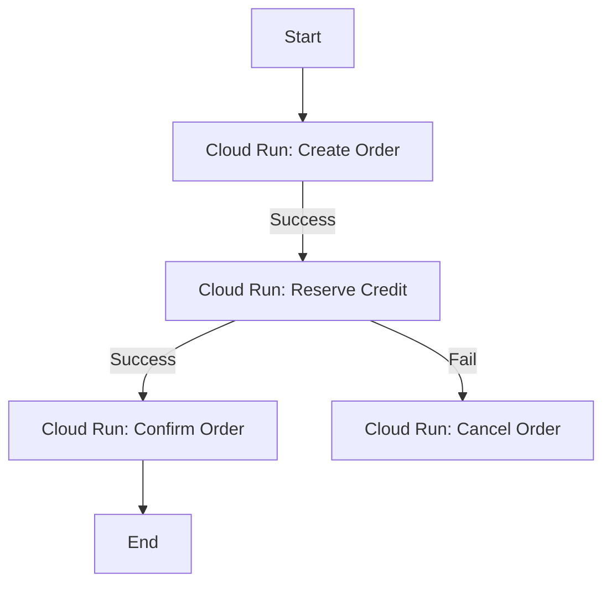

# WebLogic to GCP: Distributed Transactions Migration Guide

Legacy WebLogic applications often rely on **JTA (Java Transaction API)** and
**XA (eXtended Architecture)** to perform distributed transactions (Two-Phase
Commit / 2PC) across multiple resources, such as:

*   Updating multiple databases in a single transaction.
*   Updating a database and sending a JMS message in a single transaction (DB +
    JMS).

## Table of Contents

*   [The Serverless/Cloud-Native Challenge](#the-serverlesscloud-native-challenge) (Line 21)
*   [1. Discovery: Identifying XA/2PC Usage](#1-discovery-identifying-xa2pc-usage) (Line 36)
*   [2. Migration Pattern: Transactional Outbox (DB + Messaging)](#2-migration-pattern-transactional-outbox-db-messaging) (Line 53)
*   [3. Migration Pattern: Saga Pattern (Multi-Service/DB)](#3-migration-pattern-saga-pattern-multi-servicedb) (Line 146)
*   [4. Crucial Requirement: Idempotency](#4-crucial-requirement-idempotency) (Line 184)

--------------------------------------------------------------------------------

## The Serverless/Cloud-Native Challenge

Distributed transactions (2PC) are generally **anti-patterns** in cloud-native
microservices and serverless architectures for the following reasons:

1.  **High Latency**: 2PC requires locking resources across multiple systems
    until the transaction completes, which drastically reduces throughput.
2.  **Single Point of Failure**: If the transaction coordinator (which would
    have to run on Cloud Run) crashes during the commit phase, resources can
    remain locked indefinitely.
3.  **Scale-to-Zero Compatibility**: Cloud Run instances can be terminated
    abruptly, making them unreliable transaction coordinators.

--------------------------------------------------------------------------------

## 1. Discovery: Identifying XA/2PC Usage

During Phase 1 (Analysis), look for:

*   **XA Datasource Configurations**: In WebLogic config or deployment
    descriptors (look for `javax.sql.XADataSource` or driver class names
    containing `XA`).
*   **UserTransaction Usage**: Explicit programmatic transaction demarcation
    using `javax.transaction.UserTransaction` or
    `jakarta.transaction.UserTransaction`.
*   **EJB CMT with XA**: EJBs configured to use container-managed transactions
    that span multiple datasources or JMS resources.
*   **Spring JtaTransactionManager**: If the application already uses Spring but
    configured with a JTA manager (e.g., `WebLogicJtaTransactionManager`).

--------------------------------------------------------------------------------

## 2. Migration Pattern: Transactional Outbox (DB + Messaging)

Many legacy applications use XA to ensure that a database update and a JMS
message send either both succeed or both fail.

### Legacy XA Pattern (Before)

```
[Client] -> [WebLogic EJB]
               |
               +--> (Start JTA Transaction)
               |
               +--> [Database] (Insert Order)
               +--> [JMS Queue] (Send OrderCreated Event)
               |
               +--> (Commit JTA Transaction - 2PC)
```

### Cloud-Native Alternative: Transactional Outbox (After)

Instead of 2PC, write the event to an `outbox` table in the *same* database as
the business data, using a local transaction. A separate, reliable process then
reads from the outbox table and publishes to GCP Pub/Sub.

```
[Client] -> [Cloud Run Service]
               |
               +--> (Start Local Transaction)
               +--> [Cloud SQL] (Insert Order & Insert Outbox Event)
               +--> (Commit Local Transaction)

[Outbox Publisher (CDC/Poller)] -> Reads Outbox -> Publishes to [GCP Pub/Sub]
```

#### Code Implementation (Spring Boot Outbox Pattern)

1.  **Entity and Repository**:

    ```java
    @Entity
    @Table(name = "outbox")
    public class OutboxEvent {
        @Id @GeneratedValue
        private Long id;
        private String aggregateType;
        private String aggregateId;
        private String type;
        private String payload; // JSON payload
        // getters/setters
    }
    ```

2.  **Service (Writing Business Data + Outbox)**:

    ```java
    @Service
    public class OrderService {
        @Autowired private OrderRepository orderRepository;
        @Autowired private OutboxRepository outboxRepository;
        @Autowired private ObjectMapper objectMapper;

        @Transactional // Local transaction
        public void placeOrder(Order order) throws Exception {
            // 1. Save order
            orderRepository.save(order);

            // 2. Save event to outbox
            OutboxEvent event = new OutboxEvent();
            event.setAggregateType("Order");
            event.setAggregateId(order.getId());
            event.setType("OrderCreated");
            event.setPayload(objectMapper.writeValueAsString(order));
            outboxRepository.save(event);
        }
    }
    ```

3.  **Publisher (CDC / Poller with Concurrency Control)**:

    *   **Change Data Capture (CDC)**: Recommended for enterprise production.
        Use tools like **Debezium** or **Google Cloud Datastream** to stream
        outbox inserts directly from the PostgreSQL/MySQL transaction log
        without querying the table.
    *   **Scheduled Polling (Multi-Instance Safe)**: If polling via a scheduled
        Spring/Quarkus task across horizontally scaled Cloud Run replicas, you
        MUST prevent concurrent workers from publishing duplicate events by
        using row-level locking with **`SELECT ... FOR UPDATE SKIP LOCKED`**:
        `sql -- PostgreSQL / MySQL 8.0+ concurrency-safe outbox polling SELECT *
        FROM outbox WHERE processed = false ORDER BY id ASC LIMIT 50 FOR UPDATE
        SKIP LOCKED;`

--------------------------------------------------------------------------------

## 3. Migration Pattern: Saga Pattern (Multi-Service/DB)

If the legacy application updates multiple databases, you should split it into
microservices, each owning its database, and use the **Saga Pattern** to manage
consistency.

A Saga is a sequence of local transactions. Each local transaction updates the
database and publishes a message/event. If a step fails, the Saga executes
**compensating transactions** to undo the changes made by the preceding local
transactions.

### Types of Sagas:

1.  **Choreography**: Participants event-drivenly listen to events and execute
    their local transactions.
2.  **Orchestration**: A central controller (Orchestrator) tells the
    participants what local transactions to execute.

### GCP Implementation with Cloud Workflows (Orchestration)

You can use **Google Cloud Workflows** as a serverless orchestrator to manage a
Saga across multiple Cloud Run services.



*   **Cloud Workflows** handles the state machine, retries, and compensation
    logic.
*   Each step in the workflow calls a REST API on a Cloud Run microservice.

--------------------------------------------------------------------------------

## 4. Crucial Requirement: Idempotency

Because the Outbox pattern and GCP Pub/Sub guarantee **at-least-once delivery**,
messages may be delivered more than once.

> [!IMPORTANT] All consumers (subscribers) of events in the migrated system MUST
> be **idempotent**. They must be able to handle duplicate messages without
> causing inconsistent state.

### Implementing Idempotency

*   **Unique Message IDs**: Track processed message IDs in a database table.
    Before processing, check if the ID has already been processed.
*   **Idempotent Business Logic**: Design operations to be naturally idempotent
    (e.g., "Set status to PAID" instead of "Deduct amount").
