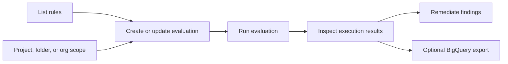

# Workload Manager Basics

Workload Manager validates enterprise workloads against Google Cloud best
practices and recommendations. The public SDK surface is centered on
evaluations: define a resource scope, choose rules, run an execution, then
inspect results and scanned resources.

## Use This Flow



## Prerequisites

1. Enable the Workload Manager API:

   ```bash
   gcloud services enable workloadmanager.googleapis.com --quiet
   ```

2. Authenticate locally before using client libraries or REST:

   ```bash
   gcloud auth application-default login
   gcloud auth login
   ```

3. Grant the narrowest role needed for the task. Start with
   `roles/workloadmanager.viewer` for read-only inspection and use
   `roles/workloadmanager.evaluationAdmin` or
   `roles/workloadmanager.admin` only when creating, updating, running, or
   deleting evaluations.

## Quick SDK Example

Use the Python client library for the first working automation path:

```bash
python3 -m pip install --upgrade google-cloud-workloadmanager
```

```python
from google.cloud import workloadmanager_v1

project_id = "PROJECT_ID"
location = "LOCATION"
parent = f"projects/{project_id}/locations/{location}"

client = workloadmanager_v1.WorkloadManagerClient()

rules = client.list_rules(
    request=workloadmanager_v1.ListRulesRequest(
        parent=parent,
        evaluation_type=workloadmanager_v1.Evaluation.EvaluationType.SQL_SERVER,
    )
)

for rule in rules.rules:
    print(rule.name, rule.display_name, rule.severity)
```

## Reference Directory

- [Core Concepts](references/core-concepts.md): Evaluations, rules,
  executions, results, scanned resources, supported workload types, and API
  shape.

- [Client Libraries](references/client-library-usage.md): Python and Go SDK
  examples for listing rules, creating evaluations, running evaluations, and
  reading findings.

- [REST Usage](references/rest-usage.md): Direct REST examples for the public
  Workload Manager API and operations polling.

- [Public CLI Status](references/public-cli-status.md): No documented
  service-specific `gcloud workload-manager` command group; use `gcloud` only
  for auth, IAM, API enablement, and REST tokens.

- [Public MCP Status](references/public-mcp-status.md): No documented public
  Workload Manager MCP server; use SDK or REST instead.

- [Setup Prerequisites](references/setup-prerequisites.md): Terraform examples
  only for adjacent prerequisites such as API enablement, IAM, BigQuery export
  datasets, and KMS keys. This is not Workload Manager resource management.

- [IAM & Security](references/iam-security.md): Workload Manager roles,
  least-privilege guidance, service agents, data handling, and CMEK notes.

If product behavior or API fields are not covered here, check the current
Workload Manager product documentation and client library reference before
implementing.

## Authoritative References

- [Workload Manager overview](https://docs.cloud.google.com/workload-manager/docs/overview)
- [Workload Manager REST API](https://docs.cloud.google.com/workload-manager/docs/reference/rest)
- [Python package](https://pypi.org/project/google-cloud-workloadmanager/)
- [Workload Manager IAM roles](https://docs.cloud.google.com/iam/docs/roles-permissions/workloadmanager)
