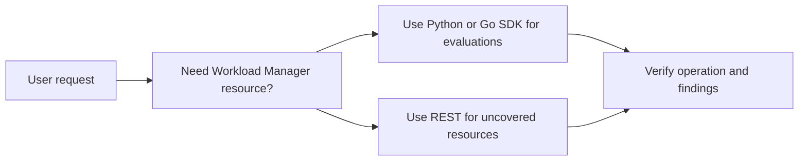

# Workload Manager Public MCP Status

No public Workload Manager MCP server is currently documented. Do not write
examples that imply Workload Manager has a public MCP integration.

Use the public SDK or REST API for production workflows.

## Current Recommendation

## Safety Rules

- Require a project, location, evaluation ID, and explicit resource scope for
  mutating operations.
- Default list operations to read-only roles.
- Require confirmation before deleting evaluations or executions.
- Surface BigQuery export destinations and CMEK key names before creating or
  updating evaluations.
