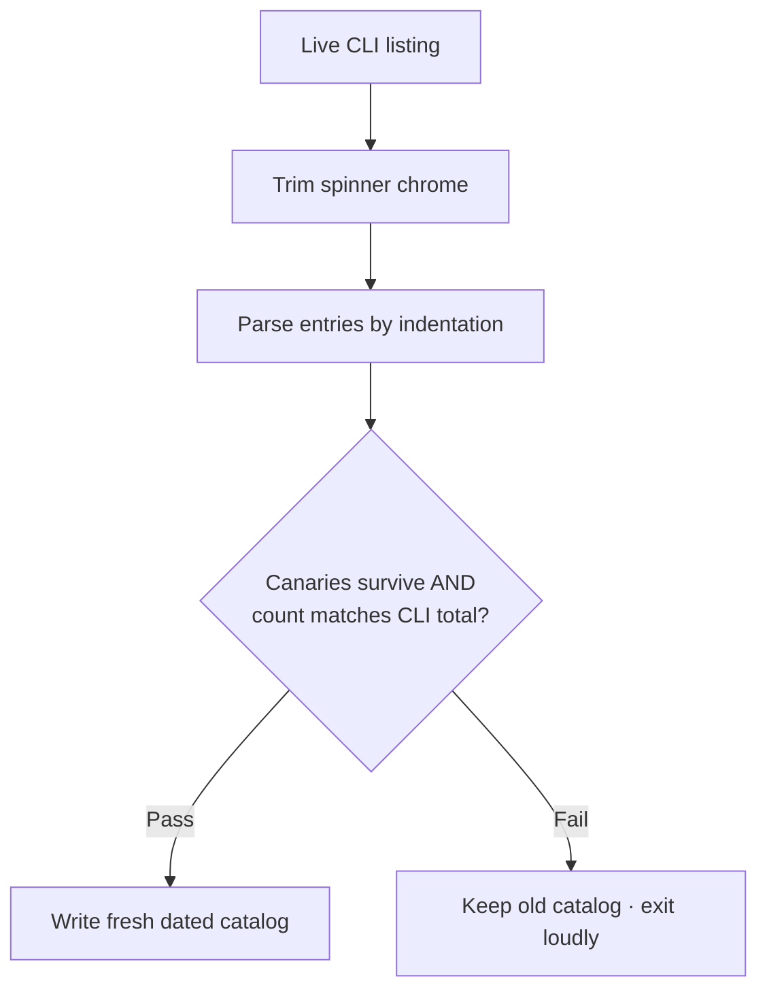

# google-skill-finder

**Ninety-plus skills in this repo. This one helps an agent find the right one — and hand you the command to install it.**

## The problem

The `google/skills` repository keeps growing: Google Cloud, GKE, BigQuery, Gemini /
Agent Platform, Google Ads, Google Analytics, and more. That breadth is the point —
but it creates a discovery problem. To pick the right skill an agent would have to
know the catalog by heart, or clone the repo and read 90+ `SKILL.md` files. Neither
scales, and stuffing every skill's description into the model's context on every
request is exactly the token bloat skills are meant to avoid.

## What this skill does

`google-skill-finder` is a phone directory for the repo. Install this one skill and
an agent can, on demand:

1. **Search** a bundled catalog of every skill — name, one-line purpose, and its
   exact install command.
2. **Return** the copy-paste command for the match:
   `npx skills add google/skills --skill <skill-name> -y`
3. **Refresh** the catalog from the live listing when something looks missing, so a
   stale snapshot never causes a false "no such skill."

No repo clone. No guesswork. One install, and the whole catalog is one lookup away.

## Install / uninstall

```bash
npx skills add google/skills --skill google-skill-finder -y   # add the finder
npx skills remove google-skill-finder -y                      # remove it
```

Once installed, finding any other skill is a single lookup that returns its own
`npx skills add ...` command.

## How it's built

```
google-skill-finder/
├── SKILL.md                  # lean instructions the agent loads on activation
├── README.md                 # this file
├── references/
│   └── catalog.md            # the full skill catalog, grouped by category
└── scripts/
    └── refresh_catalog.py    # rebuilds catalog.md from the live CLI listing
```

This layout follows the [Agent Skills specification](https://agentskills.io/specification):
`SKILL.md` for instructions, `references/` for docs read on demand, `scripts/` for
executable helpers.

### Minimal context by design (progressive disclosure)

The value here is what the model *doesn't* load until it needs to:

| Tier | What loads | When |
| --- | --- | --- |
| 1 | `name` + `description` (~100 tokens) | always |
| 2 | `SKILL.md` body (small, operational) | when the skill activates |
| 3 | `references/catalog.md` (the large list) | only when actually finding a skill |

So the catalog can list every skill in the repo without costing context on requests
that have nothing to do with skill discovery. The heavy file sits in `references/`
and is read only at the moment of the lookup.

### Refreshing the catalog

The catalog ships as a dated snapshot. When it looks stale or turns up no good match,
the agent rebuilds it from the live CLI listing instead of trusting a frozen file.
The rebuild is deliberately conservative: it validates its own work before writing,
so a bad parse never overwrites a good catalog.

The listing arrives wrapped in the CLI's spinner chrome, so the refresh first trims
that noise, then parses entries by indentation. Before writing anything it runs two
guardrails — known "canary" skills must survive the parse, and the parsed count must
match the CLI's own total. Only if both hold does it write a fresh, dated catalog. If
either fails, the existing catalog stays untouched and the run exits loudly, so a
broken directory is never shipped silently.



## Takeaway

A large skill library is only as useful as it is discoverable. `google-skill-finder`
turns "which of these do I need, and how do I install it?" into a single on-demand
lookup — self-contained, cheap on context, and safe to refresh as the repo grows.
